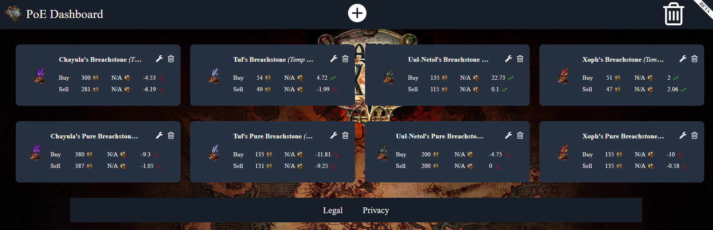
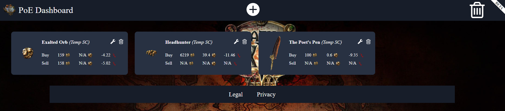

# PoE Dashboard

Customizable economy dashboard for [Path of Exile](https://www.pathofexile.com/).

https://5k-mirrors.github.io/poe-dashboard/

Status and support

- &#x2714; stable
- &#x2714; supported
- &#x2716; no ongoing development

## Use cases

### A dashboard to quickly compare prices of normal and upgraded Breachstones ([link](https://5k-mirrors.github.io/poe-dashboard/?fbclid=IwAR2k4PCtYjMVsnXO-7gcBZ_FnmQpFjrpamuhDKqJfJz9SO46Vn-qNHvvT6U&gridItems=NobwRAlgJmBcYDYBOBrADgdgBZgDRgGcBTAGyIGMAXIqASWoFtaZYMAGfYsqm%2BohgHIBDBkThgAwliEBPAK4khAcgIACAEJIiQ8lgKUA9gDsxnUhWp1GAFRlox8AGJIhAc1FHKeQuZ5QAMtqucg5g6kSULjJCJGAAvrjg0OJGAFYAzGgA7rFm3JZ8TCwAnBh5FryMwqLiUrIKymoACnJaGlo6eoYm3lwVVvy29uLObh5e5X6BbiHi4ZGyMfGJkCxgRlgGACwGAB69vgWMzHDFCJNH-NWhAKoKALQCEQYkKqotbZrauvrGpj75SqDOyhUbuIieA6AgJBWbweZRJYJJJrLBZLYARgwqSh-UKJ1gCGKFyBghEtweT0MrzUX06vx6JIGDCGoJc4MhTOmwVCCMWsWRq3EACYiK4sgA3OS4vz4kpbJmFa7iawKN4fIjtb5dP4yy4skEjdnjPU0blwsIRREClbJeBYSgADigACMjKbmQSEGUAXiquSVWraR0ft1-n1ZTZDU5jRCJr6prDeVb%2BcsUeI5KlXNjXB65ad0or-TV4AANAxoLDq1qaumh3VF4HDGNjOMe83JhbRG3p%2BAIDGiyjuxtFOAIc4J-XKssVqvB7UM8OHUmso2tzmTs1JuYp7vxAC6QA&itemsPos=NobwRA7mBcCMA0YAWMFgB4wAyIJ7cQEsYwA2AJwGsAHAdhUQFsB7ANwFMATGAMwEMANgGd2iIQBc%2B4wgGNegkQF944KHEQp1GAmHxbi0MADsAVgGZqEAWCZsu84aLASpsh0pWRUG79q160A2MkZgAWZkxbDm5ofkcxSWk5WIV2ZVVfTTRMfx0gpAhQ2FoTGzAWaPcnFySq9K8tLMQcgCY8XyCW9gBzCFYAVzKK%2BxT450S3UY8Mxt9W9ugcMHzxAA5OACMjIbsYuJEE12T9tM81NCa-MwXAkn6TbpLuncqp6onj1Przny0c690eRIpFgXXE2yiIxOh1qb0UAF0gA&layout=NobwRA7mBcCMA0YAWMFgB4wAyIJ6sQEsYxcAXAFiwFsATMRagewDcBTe6AMwEMAbAM5tEAsjzKEAxjF6C2AX3jgocRClUZseLWGLQwTXAC8AVrgB2DMM3adZQkWInTu-IYuUFkXzBvwa9MC4AayMyLABzKxsOGTdhMFFxKTi5D0gvdTRfNH8cXRJgshZcAGZ8RlZY1zlHZJd7BSUMjSzEXwAmbQCSAE4AByQWYMtK21SHRKcUmvdmlTQ2zWgu0h1Ao2DggHZJHmiqu3i65wmmz1afGFLu-MCAJ2CBLABWfoPx2YSk06-0hbUV2gNzWPX0TFg9225gAbB9qo0TjNGvIALpAA&tiles=NobwRAlgJmBcYE8AuAWADAWxgGjEhADgKZxgED2RAchAHYBWAhgJJJEYAqEANiblIySM44CG06ES8AGIAnRgHMMRWkjC4x7ADJFFAVylgO7AgAIAygGF1kcVUbLSlgBaMEe7owDkAZ1MAFPVkiUwAhYMYAY2cfJHJaPlt2ZhhYAE4AdlwfPQAjDDE2VKRZAwBfMuxRVLByBAAvegRaG3xiUgpqOiZWdi5eGwEhESSJdpl5JRU1DXEdfUNjDDMrG00Me0d4FzcPbz9w3WjY%2BMT1lLgMtGy8gqQiuBLyyurSADMAa3qkNAVWyQ6lBoDBY4n6iSGwlgojBAImimUqjWc10CgMpCWK2ss3Ym0WHl8ASCIUOURicQSyOSqTSKBu%2BUKRGKpSIFSqkBqHyQADcEABmBD-cZkIHdUF9HgQwRQmF9OFgOQI6ZUjDzNGLEwWbGjPEYgkHCLHClncQXWAANiyYByDPuTMeLLZr3gaQIzm5HxauDahk6wJ6YMlg2lI3WHHliqmSJxqtR6PgmK1Kt18AAqh4ALRUIhxbiEwLBMKG8mnFVmtLm%2Bl3B6wJ6sl4c0j1D4fDKRYTe%2BV%2BsW9ThB-gh6GjcPCyOImajNXxoya1YxlNgdPcLM58h5g1HEuUmNm81pKuM5nPdnQUiyD4%2BNAAVgIQt9opBvfBweGQ7DEcm45VU41yyT84cQwAA1yDdQlSSNUsd1Sc1K2tW5DwdY9nVqABGWQMloc070BLpH0DAYB1fWUxkMMdlRjH8MVnbV1gXECwL8AsSWLE5t1Gcs%2BQPO0j3rABdIA))

### A dashboard to see the prices of popular high-value items ([link](https://5k-mirrors.github.io/poe-dashboard/?layout=NobwRA7mBcCMA0YAWMFgB4wAyIJ7cQEsYwAHQgFkIDYBmMRAWwHsA3AUwBMYAzAQwA2AZ3aIhAFz7jCAY16CRAX3jgocRCnUZUeAmGLQwAV1ZHCrIQzAsO3aP2GiwEqbPmPlqncm%2BZoAJl1oHH0SAEdxAA4Aa04AdisbLncRMUlpOXsFdkUAXSA&tiles=NobwRAlgJmBcYAcIBYIDYDMYA0YAuAnggKZyID2xAchAHYBWAhgJJ7EC2AKhADam5RGeRnHAQ2XIqXgBhAK4AnBcVoBjAjkgSAMsUYBzOdLCcOCAAQBlGZvEcqjdsYCiAD0Y82UcwHkFAI1sJZhhYACYAXwjsMVCwOQA3OQgEgGdNQhIyBEoaBhYJbj5NQWFRLQ5OKTIAVVoIAEcjAEFVVWJU1PIFDVw7dl0DIzJTdgtrIPtHYwAJPSgACzlaNgVJ9hC4NAAGAHZcVLl-dnEvODwFIyiYyDiGvAAOAGsoXYzq%2BBzqOiZWSt5%2BGBSiJYGJCh8wHVGkYAOp6HK0daDQzGUbjGx9CQOJwjBbEcwABUoeAA5KlCSp1ptwmEAKwPA5HE54M6wC5XCIAXSAA))

## Saving / Sharing
Your chosen items will be remembered by the browser. You can use the URL to share, export and import your list. Always the current, up to date values will be shown on each item.
